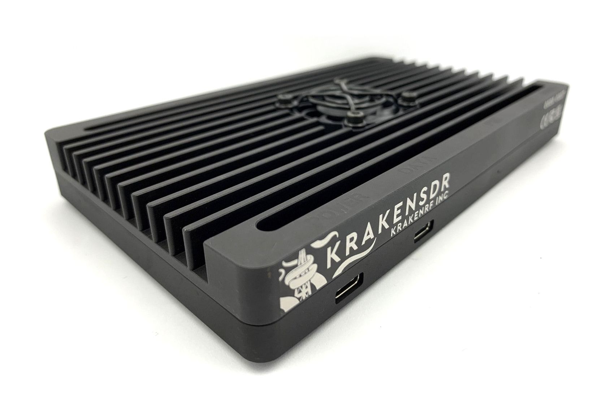
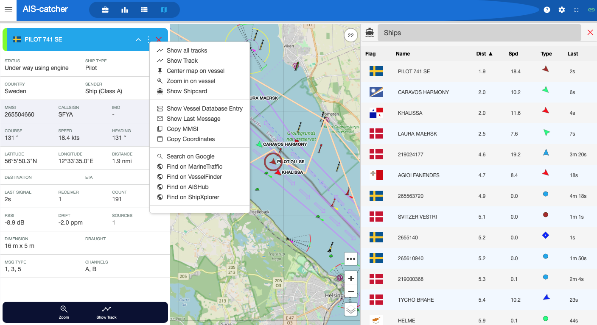
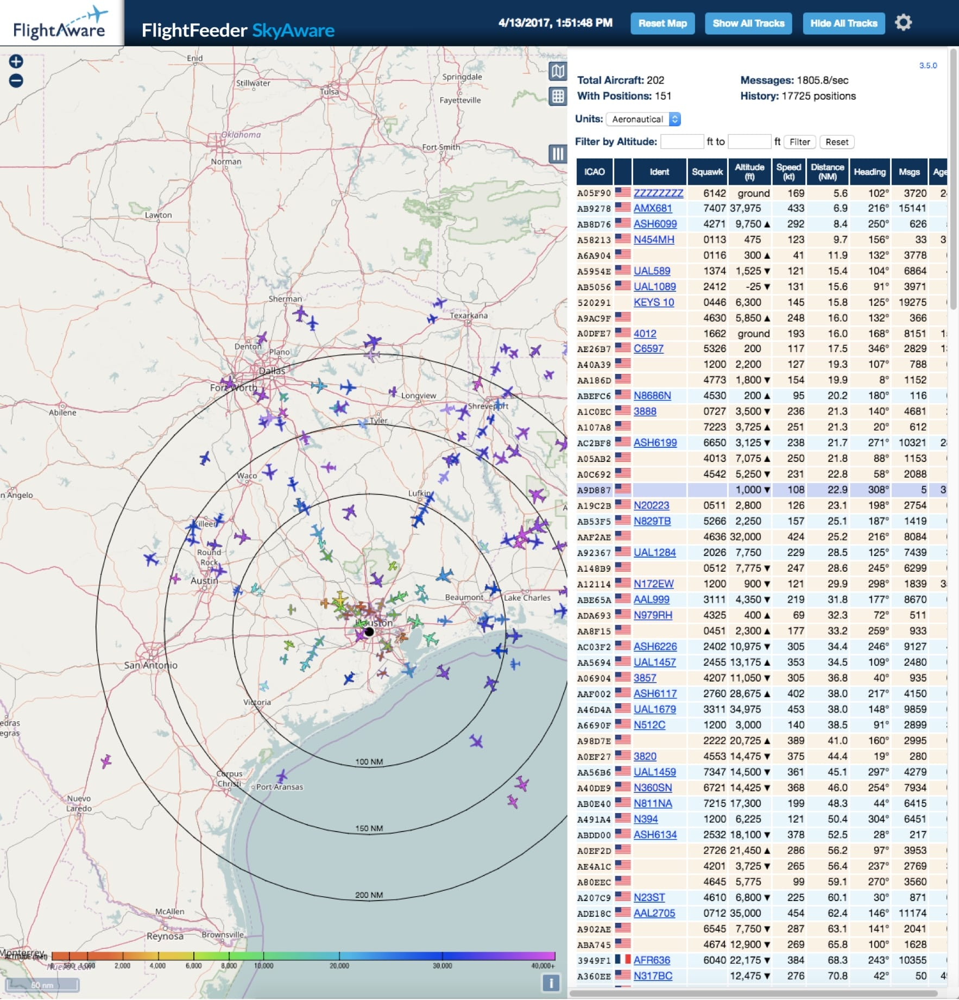
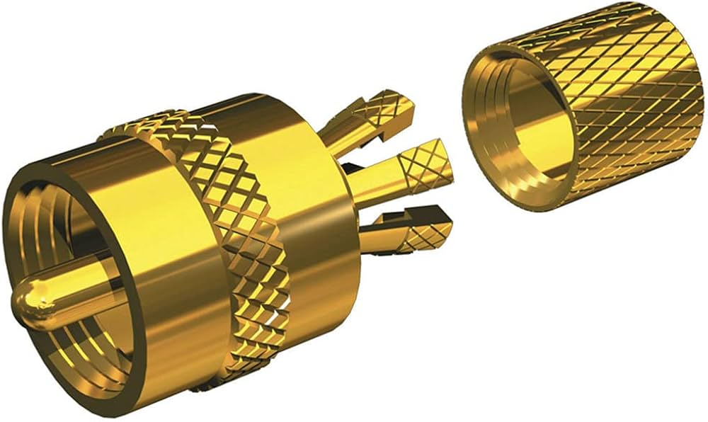
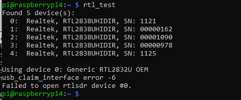

# Notes on KrakenSDR in Non-Coherent Installations

If you have more money than sense (or are just opposed to buying standalone USB hubs), you can use the excellent KrakenSDR as 5x standalone RTL-SDR units. 

**It is easier to just use 5x RTL-SDRs and a powered USB hub. But if you must... see below.**

## Intro
The [KrakenSDR](https://www.krakenrf.com/) is the successor to the [KerberosSDR](https://www.rtl-sdr.com/ksdr/) and provides 5x coherent channels, USB hub, common clock and accessories in a lovely aluminum case with a cooling fan. The unit is very elegantly designed and would be right at home with mil-spec hardware. 

  

# Applications
Normally one would use phase-coherent SDRs for DOA (direction of arrival) or passive radar. If, instead, you want to use it as 5x RTL-SDRs for normal SDR things, this guide will provide some notes.

## AIS
  
I recently discovered the excellent [AIS Catcher](https://github.com/jvde-github/AIS-catcher) suite.  
This suite has the best visualization and most comprehensive options of any AIS suite that I've seen to date.  
This unit can use RTL-SDRs (and others) to listen to 162 Mhz AIS signals and decode them.  
I contribute to [AIShub](https://www.aishub.net/), [MarineTraffic](https://www.marinetraffic.com/) and [AIS Catcher](https://aiscatcher.org) directly. 

## ADS-B and UAT
  
I actively contribute to [FlightAware](https://www.flightaware.com/), [ADS-B Exchange](https://globe.adsbexchange.com/) for both 1099 Mhz ADS-B and 978 Mhz UAT data. 

I use `dump1090-fa` and `dump978-fa` to push data to sources and to `piaware` for local plotting. Installing these on the latest raspbian can be a bit of a pain, especially if you don't want to use their pre-built image, so consult the internet for the latest steps to compile. 

## LiveATC
  
Being very near an airport (KGON), I recently started contributing to [LiveATC](https://www.liveatc.net/). I installed a separate antenna and use two tuners to cover both ground, tower and a few local frequncies. 

# Powering the Kraken SDR
I run my pi on the official [Pi PoE hat](https://www.raspberrypi.com/products/poe-hat/).
**Somewhat oddly** you can plug a USB-C -- USB-C cable into the pi and draw power to the Kraken. I was not expecting this to work, but it seems stable. Over POE, with the bias-T s set to on, the unit can draw ~15W over PoE.


# Additional Hardware

## Antennas
Clearly you need to match your antenna to your application. I've detailed what I've been using. All of these are mounted on a metal-roofed building that is approximately 30ft from the ground. **Remember to use sufficient lighting protection and filtering, otherwise stray lightning can blow up your hardware.**

## Filters 
No matter how cool your SDR front-end is, you can't cheat physics (note; this applies in other fields as well). Reception range and quality of all signals is dramatically improved with LNAs and notch filters. 

### AIS
I use a [Shakespeare 8900](https://www.westmarine.com/shakespeare-mariner-8900-8--6db-vhf-antenna-6966071.html)  
**NOTE: although the 6dB gain is helpful in a fixed application, it is probably too high for a dynamic platform.**

**BIG NOTE: the included no-solder termination that is included with these antenna is GARBAGE. It will roughly fit a Times Microwave LMR-240 (and probably LMR-195) solder connection. I used one of these after experiencing frustration with the included connector.**  
**DO NOT USE THIS CONNECTOR**



**DO NOT USE THIS CONNECTOR**

For filtering AIS I use the [Uptronics preamp for AIS](https://shop.wegmatt.com/collections/accessories/products/uputronics-filtered-preamplifier-for-ais). Author's note: Wegmatt is awesome and does great stuff.  
This filter/LNA can be powered either by USB-C or bias-T power. 

### ADS-B and UAT 
I use a pair of [Flight Aware Antennas](https://flightaware.store/products/antenna-1090mhz) (I think their previous antennas were tuned for both UAT and ADS-B, now they seem to have multiple offerings.)  

I use the [Nooelec Sawbird dual channel filter/LNA](https://www.amazon.com/Nooelec-SAWbird-ADS-B-Dual-Channel-Applications/dp/B0CBD1KK3G) to filter both channels and amplify them both. Anecdotally I've noticed my furthest received signal move from ~150 miles to ~200 miles for high flying aircraft. This unit is nice because it has LEDs to show that it's receiving power. It can be powered either by micro-USB or bias-T power.

### VHF Airband
I used a [Dual Airband](https://www.wimo.com/en/d-777) Antenna for VHF airband. The semi-discone ground plane looks pretty cool, but probably isn't doing much in my installation. 

I used a cheap [Amazon band pass filter](https://www.amazon.com/KANGQL-BPF118-Bandpass-BPF118-136MHz-Frequency/dp/B0DGQB6C1Z) for my VHF air band reception (to LiveATC). I don't have previous experience with these units, I will report back with further experience. This is a purely passive filter

# Specifics for the KrakenSDR (The Interesting Bit)

## Serial Numbers
By default the KrakenSDR numbers the constituent receivers in a dissimilar way to RTL-SDR units. 
From the factory they are:
```
1000
1001
1002
1003
1004
```

Note: A standard RTL-SDR has an 8 digit with padding zeros (i.e. `00000001`).  

In order to do basic diagnostics and troubleshooting, I recommend you download the `rtl-sdr` tools from [RTL-SDR on Github](https://github.com/osmocom/rtl-sdr/tree/master). Invoke with `rtl_test` to see a list of available devices by both index and serial number:



(this shows that my serial numbers are somewhat inconsistent, which is functionally fine, but aesthetically displeasing.)

**You can use `rtl_eeprom` tool to reprogram serial numbers on the Kraken SDR to either in the 4 digit or 8 digit format**

Invoke the eeprom tool with something like `rtl_eeprom -d 0 -s 00001090` where `-d 0` is device index `0` and `-s` is the desired serial number. Thankfully, the CLI will give you confirmation of which serial number you're changing. 
 
**Don't even think about changing the Bias-T or vendor ID using this tool. On the Kraken it will do strange things**

### Calling by Serial Number or Device Index
Some programs are inconsistent about how they call RTL-SDR devices. One perk of the KrakenSDR is that you get deterministic order of devices, unlike a gaggle of units plugged into a USB hub. 

#### AIS Catcher
Edit the `/etc/AIS-catcher/config.cmd` file: 
Per their [manpage](https://github.com/jvde-github/AIS-catcher#detailed-settings) you can invoke either of the following:  
To call by device index (where 1 is the index of the radio, again use `rtl_test` to check these):
```
-d:1
```

To call by serial number (recommended) where the 4 or 8 digit number is the device serial number:
```
-d 00000162
```

#### Dump1090-fa and Dump978-fa
From [these instructions on github](https://github.com/abcd567a/piaware-ubuntu20-amd64/blob/master/README.md) you can edit the config files with one command line. 

```
sudo sed -i 's/^RECEIVER_SERIAL=.*/RECEIVER_SERIAL=00001090/' /etc/default/dump1090-fa
```

Where the receiver serial number is the one you intend. 

For Dump978-fa

```
sudo sed -i 's/driver=rtlsdr[^ ]* /driver=rtlsdr,serial=00000978 /' /etc/default/dump978-fa
```

Again, with the correct serial. 

#### RTL-Airband
Although LiveATC's instructions don't reflect this yet, RTL-Airband can use either device index or serial number.
From their [manpage](https://github.com/charlie-foxtrot/RTLSDR-Airband/wiki/Configuring-RTLSDR-devices).

```
index = 0;
```
or 
 
```
serial = "00000384";
```

This seems to work reliably. 

# THE SERIOUSLY IMPORTANT BIT

## Noise Source Enabling (or not) 

**The bias-T instructions for KrakenSDR are SIGNIFICANTLY different than the stock RTL-SDR units. Do not assume your existing workflow will work**. 

#### Noise Source
The KrakenSDR includes a noise source that is useful for synchronizing the coherent receivers and calibrating DoA systems. We are not using it here, BUT: if it is on, none of our reception will work. 

After some experimenting and reading the KrakenSDR [wiki page](https://github.com/krakenrf/krakensdr_docs/wiki/12.-Appendix#krakensdr-manual-bias-tee-control) and [this forum thread](https://forum.krakenrf.com/t/bias-t-enable-in-5-x-sdr-mode/815), all of the above are incorrect. 

#### To Toggle Noise Generation
Use the following invocation of `rtl_biast`  
```
sudo rtl_biast -d 1 -g 0 -b 0
``` 

Where:  
`-d 1` is device index 1 (I don't know why this is the one that it likes...but it is. 0 does not work).  
`-g 0` is GPIO 0, which is the noise source.  
`-b 0` is disable. Switch to `-b 1` if you desire it to be on. 

## Bias-T Enabling
Again, above we see that the instructions for this are inconsistent. It took me a while and some experiments to get it right. 

To enable the Bias-T power for Channel 0 (GPIO 1 though)  

```
sudo rtl_biast -d 1 -g 1 -b 1
```
Again, with device 1, but this time GPIO 1, and enable with a 1 value.

**Increment from 1 to 5 to enable the bias-T for channels 0 to 4**.

### Having Other Software Invoke the Bias-T
Both dump1090-fa and AIS Catcher can automatically invoke the bias-T feature. **DO NOT DO THIS.** It will not work.  
Only use `rtl_biast` as above to turn on and off bias-T power. 

### Scripting the Bias-T
In order to comply with some of the quirks of the dump1090-fa (it can get overwritten by the sotware on changes) service I set a systemd service that looks like the following:

```
[Unit]
Description=Set Bias T on Kraken SDR
Before=dump1090.service
Before=dump976.service
Before=AIS-catcher.service
Before=liveatc.service
After=local-fs.target
After=network.target
#After=XXX

[Service]
ExecStart=/home/pi/set-bias-t-on.sh
RemainAfterExit=true
Type=oneshot

[Install]
RequiredBy=multi-user.target
RequiredBy=dump1090-fa.service
RequiredBy=dump978-fa.service
RequiredBy=ais-catcher.service
RequiredBy=liveatc.service
```

This then invokes the script `/home/pi/set-bias-t-on.sh`

**NOTE** When installing this service, be sure to run `sudo systemctl daemon-reload` after edist are finished. Then run `sudo systemctl enable set-bias-t.service` to link the requirements to the other services. 

This is as follows:

```
#!/bin/bash

## script to turn on the Bias T (and turn off the noise settings) for the Kraken SDR
GREEN='\033[1;32m'
NC='\033[0m'

echo ""
echo -e "${GREEN}Turning off noise source ${NC}"
rtl_biast -d 1 -g 0 -b 0

echo ""
echo -e "${GREEN}Turning on AIS Bias-T ${NC}"
rtl_biast -d 1 -g 1 -b 1

echo ""
echo -e "${GREEN}Turning on 1090 Bias-T ${NC}"
rtl_biast -d 1 -g 2 -b 1

echo ""
echo -e "${GREEN}Turning on 978 Bias-T ${NC}"
rtl_biast -d 1 -g 3 -b 1

echo ""
echo -e "${GREEN}Done. Exiting #{NC}"
```

This script is run before any of the other services and is called when they are, by requirement. 

This puts the noise source and bias-T into the correct state and allows for the best reception. 


